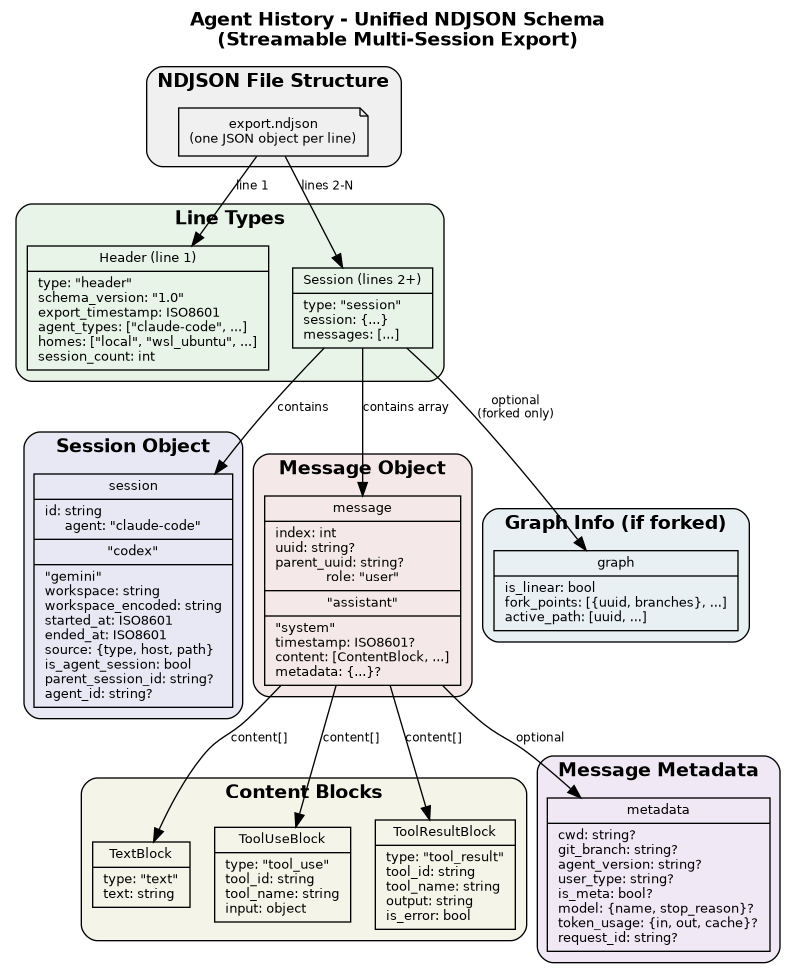

# Unified NDJSON Schema for Agent History

This document describes the normalized NDJSON format used by `--json` export, providing a consistent, streamable structure across all supported AI coding assistants (Claude Code, Codex CLI, Gemini CLI).



## Design Goals

1. **Unified format**: Same schema regardless of source agent
2. **Streamable**: NDJSON allows line-by-line processing without loading entire file
3. **Multi-scope**: Single export can span multiple homes, workspaces, sessions, and agents
4. **Lossless**: Preserve all meaningful information from source formats
5. **Round-trip capable**: Can reconstruct equivalent markdown from NDJSON

## File Format

- **Format**: NDJSON (Newline Delimited JSON)
- **Extension**: `.ndjson`
- **Encoding**: UTF-8
- **Structure**: One JSON object per line, streamable

```
Line 1: Header (export metadata)
Line 2: Session record
Line 3: Session record
...
Line N: Session record
```

## Why NDJSON?

| Format | Streamable | Multi-session | Memory efficient |
|--------|------------|---------------|------------------|
| JSON   | No         | Awkward       | No (load all)    |
| JSONL  | Yes        | Yes           | Yes              |
| NDJSON | Yes        | Yes           | Yes              |

NDJSON is the standardized name for JSONL. We use `.ndjson` extension for clarity.

## Schema Overview

### Line Types

Every line has a `type` field:

| Type | Description | Count |
|------|-------------|-------|
| `header` | Export metadata | Exactly 1 (first line) |
| `session` | Complete session with messages | 0 or more |

### Header Record (Line 1)

```json
{
  "type": "header",
  "schema_version": "1.0",
  "export_timestamp": "2025-12-27T10:30:00Z",
  "agent_types": ["claude-code", "codex", "gemini"],
  "homes": ["local", "wsl_ubuntu", "remote_vm01"],
  "workspaces": ["myproject", "other-project"],
  "session_count": 42
}
```

| Field | Type | Required | Description |
|-------|------|----------|-------------|
| `type` | string | Yes | Always `"header"` |
| `schema_version` | string | Yes | Schema version (semver) |
| `export_timestamp` | string | Yes | ISO 8601 timestamp of export |
| `agent_types` | array | Yes | Agent types included in export |
| `homes` | array | Yes | Source homes included |
| `workspaces` | array | Yes | Workspace names included |
| `session_count` | int | Yes | Total sessions in file |

### Session Record (Lines 2+)

```json
{
  "type": "session",
  "session": { ... },
  "messages": [ ... ],
  "graph": { ... }
}
```

| Field | Type | Required | Description |
|-------|------|----------|-------------|
| `type` | string | Yes | Always `"session"` |
| `session` | object | Yes | Session metadata |
| `messages` | array | Yes | Array of message objects |
| `graph` | object | No | Fork/branch info (if not linear) |

## Session Object

```json
{
  "id": "abc123-def456",
  "agent": "claude-code",
  "workspace": "/home/user/myproject",
  "workspace_encoded": "-home-user-myproject",
  "started_at": "2025-12-27T09:00:00Z",
  "ended_at": "2025-12-27T10:30:00Z",
  "source": {
    "type": "local",
    "host": null,
    "path": "/home/user/.claude/projects/-home-user-myproject/abc123.jsonl"
  },
  "is_agent_session": false,
  "parent_session_id": null,
  "agent_id": null
}
```

| Field | Type | Required | Description |
|-------|------|----------|-------------|
| `id` | string | Yes | Unique session identifier |
| `agent` | string | Yes | `claude-code`, `codex`, or `gemini` |
| `workspace` | string | Yes | Human-readable workspace path |
| `workspace_encoded` | string | Yes | Encoded workspace directory name |
| `started_at` | string | Yes | First message timestamp |
| `ended_at` | string | Yes | Last message timestamp |
| `source.type` | string | Yes | `local`, `wsl`, `windows`, `remote` |
| `source.host` | string | No | Remote hostname or WSL distro |
| `source.path` | string | Yes | Original file path |
| `is_agent_session` | bool | Yes | True if this is a sub-agent task |
| `parent_session_id` | string | No | Parent session for agent tasks |
| `agent_id` | string | No | Agent ID for agent tasks |

## Message Object

```json
{
  "index": 1,
  "uuid": "msg-uuid-123",
  "parent_uuid": "msg-uuid-122",
  "role": "user",
  "timestamp": "2025-12-27T09:00:00Z",
  "content": [ ... ],
  "metadata": { ... }
}
```

| Field | Type | Required | Description |
|-------|------|----------|-------------|
| `index` | int | Yes | 1-based message index |
| `uuid` | string | No | Unique message ID (if available) |
| `parent_uuid` | string | No | Parent message ID (for graph/fork tracking) |
| `role` | string | Yes | `user`, `assistant`, `system` |
| `timestamp` | string | No | ISO 8601 message timestamp |
| `content` | array | Yes | Content blocks (see below) |
| `metadata` | object | No | Additional metadata |

## Content Blocks

Content is an array of typed blocks, supporting mixed content (text + tools):

### Text Block

```json
{
  "type": "text",
  "text": "Hello, how can I help?"
}
```

### Tool Use Block (Assistant requesting tool)

```json
{
  "type": "tool_use",
  "tool_id": "tool_abc123",
  "tool_name": "Bash",
  "input": {
    "command": "ls -la",
    "description": "List files"
  }
}
```

### Tool Result Block (Result of tool execution)

```json
{
  "type": "tool_result",
  "tool_id": "tool_abc123",
  "tool_name": "Bash",
  "output": "total 128\ndrwxr-xr-x ...",
  "is_error": false
}
```

## Message Metadata

```json
{
  "cwd": "/home/user/myproject",
  "git_branch": "main",
  "agent_version": "1.0.29",
  "user_type": "external",
  "is_meta": false,
  "model": {
    "name": "claude-sonnet-4-5-20250929",
    "stop_reason": "end_turn",
    "stop_sequence": null
  },
  "token_usage": {
    "input_tokens": 1500,
    "output_tokens": 350,
    "cache_creation_tokens": 0,
    "cache_read_tokens": 1200
  },
  "request_id": "req_abc123"
}
```

| Field | Type | Description |
|-------|------|-------------|
| `cwd` | string | Working directory |
| `git_branch` | string | Git branch name |
| `agent_version` | string | Claude Code/Codex/Gemini version |
| `user_type` | string | User type identifier |
| `is_meta` | bool | System/meta message indicator |
| `model` | object | Model info (assistant messages only) |
| `token_usage` | object | Token counts (assistant messages only) |
| `request_id` | string | API request ID |

## Conversation Graph (Optional)

For sessions with forks (user went back and branched):

```json
{
  "is_linear": false,
  "fork_points": [
    {
      "uuid": "msg-uuid-5",
      "index": 5,
      "branches": [
        {"uuid": "msg-uuid-6a", "index": 6},
        {"uuid": "msg-uuid-6b", "index": 7}
      ]
    }
  ],
  "active_path": ["msg-uuid-1", "msg-uuid-2", "msg-uuid-10"]
}
```

Only included when `is_linear` is false.

## Agent-Specific Mapping

### Claude Code

| Claude Code Field | Unified Field |
|-------------------|---------------|
| `uuid` | `messages[].uuid` |
| `parentUuid` | `messages[].parent_uuid` |
| `sessionId` | `session.id` |
| `agentId` | `session.agent_id` |
| `isSidechain` | `session.is_agent_session` |
| `isMeta` | `messages[].metadata.is_meta` |
| `cwd` | `messages[].metadata.cwd` |
| `message.model` | `messages[].metadata.model.name` |
| `message.stopReason` | `messages[].metadata.model.stop_reason` |
| `message.usage` | `messages[].metadata.token_usage` |

### Codex CLI

| Codex CLI Field | Unified Field |
|-----------------|---------------|
| `id` | `messages[].uuid` |
| `session.id` | `session.id` |
| `content` | `messages[].content` |
| `role` | `messages[].role` |

### Gemini CLI

| Gemini CLI Field | Unified Field |
|------------------|---------------|
| (TBD - needs investigation) | |

## Complete Example

**File: `export.ndjson`**

```ndjson
{"type":"header","schema_version":"1.0","export_timestamp":"2025-12-27T10:30:00Z","agent_types":["claude-code"],"homes":["local","wsl_ubuntu"],"workspaces":["myproject"],"session_count":2}
{"type":"session","session":{"id":"c7e6fbcb","agent":"claude-code","workspace":"/home/user/myproject","workspace_encoded":"-home-user-myproject","started_at":"2025-12-27T09:00:00Z","ended_at":"2025-12-27T09:15:00Z","source":{"type":"local","host":null,"path":"/home/user/.claude/projects/-home-user-myproject/c7e6fbcb.jsonl"},"is_agent_session":false,"parent_session_id":null,"agent_id":null},"messages":[{"index":1,"uuid":"msg-001","parent_uuid":null,"role":"user","timestamp":"2025-12-27T09:00:00Z","content":[{"type":"text","text":"List files"}],"metadata":{"cwd":"/home/user/myproject"}},{"index":2,"uuid":"msg-002","parent_uuid":"msg-001","role":"assistant","timestamp":"2025-12-27T09:00:05Z","content":[{"type":"text","text":"I'll list the files."},{"type":"tool_use","tool_id":"tool_001","tool_name":"Bash","input":{"command":"ls -la"}}],"metadata":{"model":{"name":"claude-sonnet-4-5-20250929","stop_reason":"tool_use"}}}]}
{"type":"session","session":{"id":"d8f7ghij","agent":"claude-code","workspace":"/home/user/myproject","workspace_encoded":"-home-user-myproject","started_at":"2025-12-27T10:00:00Z","ended_at":"2025-12-27T10:30:00Z","source":{"type":"wsl","host":"ubuntu","path":"/home/user/.claude/projects/-home-user-myproject/d8f7ghij.jsonl"},"is_agent_session":false,"parent_session_id":null,"agent_id":null},"messages":[{"index":1,"uuid":"msg-003","parent_uuid":null,"role":"user","timestamp":"2025-12-27T10:00:00Z","content":[{"type":"text","text":"Hello"}]}]}
```

**Formatted for readability** (actual file has one JSON per line):

Line 1 (Header):
```json
{
  "type": "header",
  "schema_version": "1.0",
  "export_timestamp": "2025-12-27T10:30:00Z",
  "agent_types": ["claude-code"],
  "homes": ["local", "wsl_ubuntu"],
  "workspaces": ["myproject"],
  "session_count": 2
}
```

Line 2 (Session from local):
```json
{
  "type": "session",
  "session": {
    "id": "c7e6fbcb",
    "agent": "claude-code",
    "workspace": "/home/user/myproject",
    "source": {"type": "local", "host": null, "path": "..."}
  },
  "messages": [...]
}
```

Line 3 (Session from WSL):
```json
{
  "type": "session",
  "session": {
    "id": "d8f7ghij",
    "agent": "claude-code",
    "workspace": "/home/user/myproject",
    "source": {"type": "wsl", "host": "ubuntu", "path": "..."}
  },
  "messages": [...]
}
```

## Streaming Usage

```python
import json

with open("export.ndjson") as f:
    header = json.loads(f.readline())
    print(f"Exporting {header['session_count']} sessions")

    for line in f:
        record = json.loads(line)
        session = record["session"]
        messages = record["messages"]
        # Process each session independently
        print(f"Session {session['id']}: {len(messages)} messages")
```

## CLI Usage

```bash
# Export everything to NDJSON
./agent-history export --ah --aw --json -o ./backup

# Output: ./backup/export_20251227_103000.ndjson

# Export specific workspace
./agent-history export myproject --json

# Export with both --source (raw) and --json (normalized)
./agent-history export myproject --source --json
```

## Versioning

- Schema follows semantic versioning
- Minor version bumps: additive, backward-compatible changes
- Major version bumps: breaking changes
- `schema_version` field enables consumers to handle different versions

## Questions for Review

1. **Tool result placement**: Currently tool results appear as user messages (how Claude API works). Should we restructure to group tool_use + tool_result together?

2. **Graph representation**: Is the fork_points + active_path model sufficient, or do we need full tree structure?

3. **Agent-specific extensions**: Should we have an `extensions` field for agent-specific data that doesn't map cleanly?

4. **Compression**: For very large exports, should we support `.ndjson.gz`?

5. **Session ordering**: Should sessions be sorted by timestamp, workspace, or source?
